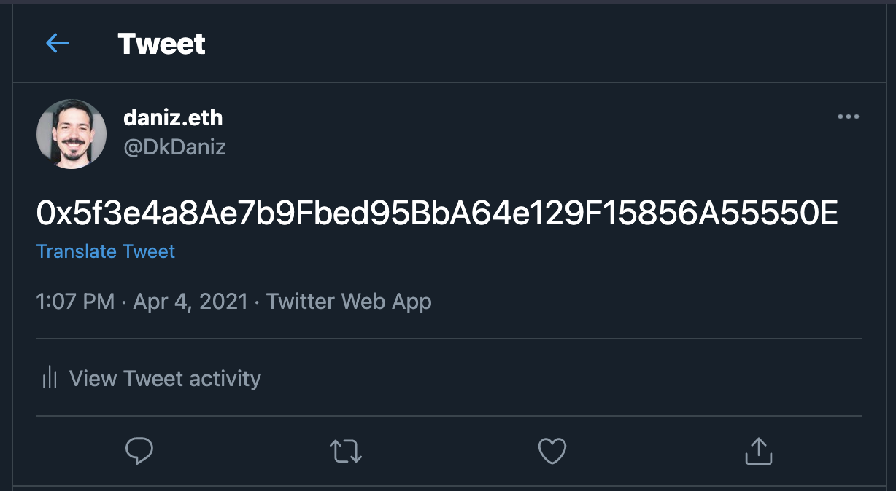

# How Implement Metamask in your website

## Install Metamask Extensions

1 - **Access the website official** 
```
https://metamask.io/download.html
```
2 - **Install Metamask in your browser. Currently the Metamask Supported Browsers (Chrome, Firefox, Braves, Edge)**

3 - **Add Extension**


## Setup Metamask

1 - **Open Metamask**


2 - **Choose between Import Backup or New Wallet**


In this tutorial we will click in **Create a Wallet**

3 - **Accept Terms of Use**

Basically the team Metamask say that all your data are storage only local and don't send it to any server. 


4 - **Define a password**

I personally like of password with minimum of 14 digits that include Letter LowerCase, Letter UpperCase, Numbers, Character Especial.


5 - **PLEASE DO BACKUP OF YOUR WALLET**


6 - **Wallet was created**


## Setup for use in development

1 - Alter network for Rinkeby


2 - Copy your Address Ethereum in metamask wallet


For Example: 
```
0x5f3e4a8Ae7b9Fbed95BbA64e129F15856A55550E
```

3 - Past your address in any social network in public mode. I'll use the Twitter.



4 - Copy link of publication and access Rinkeby Faucet

```
https://www.rinkeby.io/#faucet
```

5 - Past link of your publication and select 18.75 ETH.


6 - loading and your wallet metamask will have 18.75 ETH.


## Development a Simple Website HTML

1 - Create a file with the name **index.html** and insert the following code:

```html
<!DOCTYPE html>
<html lang="en">
<head>
    <meta charset="UTF-8">
    <meta http-equiv="X-UA-Compatible" content="IE=edge">
    <meta name="viewport" content="width=device-width, initial-scale=1.0">

    <script src="https://cdnjs.cloudflare.com/ajax/libs/web3/1.3.4/web3.min.js" integrity="sha512-TTGImODeszogiro9DUvleC9NJVnxO6M0+69nbM3YE9SYcVe4wZp2XYpELtcikuFZO9vjXNPyeoHAhS5DHzX1ZQ==" crossorigin="anonymous"></script>

    <style>
        div {
            margin-top: 10px;
        }
    </style>
    

    <title>Metamask Example</title>
</head>
<body>
    <div>
        <h2>This is my balance</h2>
        <button onclick="getBalance()">Update my balance</button>
        <span id="myBalance"></span> in Ether
    </div>
    
    <div>
        <h2>Send Ether</h2>
        <input id="to" name="address" placeholder="address"/>
        <input id="value" name="value" type="number" placeholder="value in Ether"/>
        <button type="button" onclick="sendTransaction()">Send</button>
    </div>
   
    <script src="index.js"></script>
</body>
</html>
```
1 - Create a file with the name **index.js** and insert the following code:

```javascript
let web3 = Web3 | undefined;

async function authentication() {  
    web3 = Web3 | undefined;
    if (!web3) {
        try {
            const networkId = parseInt((window).ethereum.chainId);
            if(networkId !== 4){
                window.alert('NETWORK INVALID');
                return false;
            } else { 
                await (window).ethereum.enable();
                web3 = new Web3((window).ethereum);
                
                return true;
            }
        } catch (error) {
            window.alert('error in process MetaMask.');
            return false;
        }
    }else{
        console.log('You Need of Metamask')
        return false;
    }
}

async function getBalance(){    
    await authentication();
    console.log(web3.givenProvider.selectedAddress)
    web3.eth.getBalance(web3.givenProvider.selectedAddress, function (err, result) {
        if (!err) {
            document.getElementById("myBalance").innerText = web3.utils.fromWei(result, "ether");
        } else {
            console.error(err);
        }
    });
}

async function sendTransaction(){
    await authentication();

    let addressTo = document.getElementById("to").value;
    let valueSend = document.getElementById("value").value;

    console.log(web3);

    web3.eth.sendTransaction({
        from: web3.givenProvider.selectedAddress,
        to: addressTo.toString(),
        value: web3.utils.toWei(valueSend, "ether")
    })
    .on('confirmation', function(confirmationNumber, receipt){ 
        if(confirmationNumber === 6){
            getBalance();
        }
     })
    .on('error', function(){
        window.alert('Erro: Payment dont was processed');
        console.log(error)
    });
}
```

## Conclusion

Now you can modify, alter and create most functions for your website use metamask.


